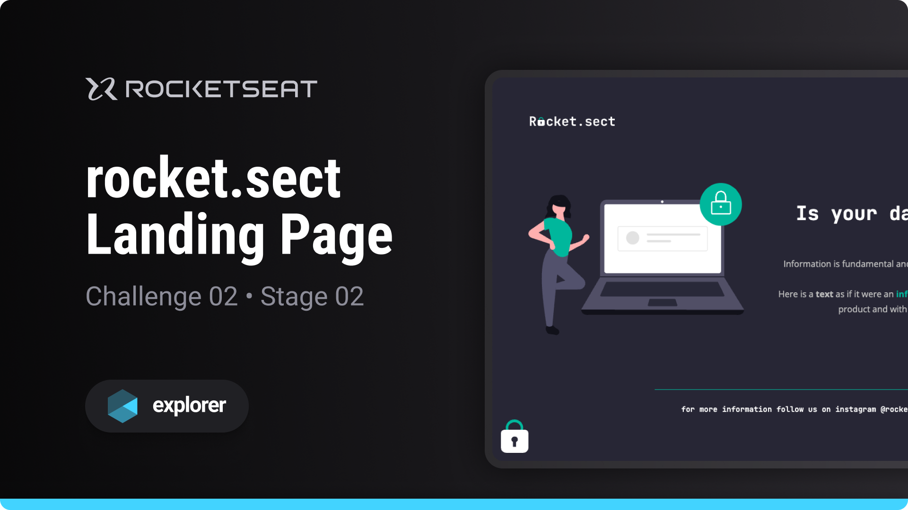

# 

Challenge developed on Rocketseat's Explorer course

**Rocket.sect is a landing page designed to put into practice the basic concepts of web development**

## 🔗 Project Links

- 🚀 [**Deploy**](https://emanueltavecia.github.io/rocket.sect)
- 🎨 [**Figma**](https://www.figma.com/file/EdKjPWjC8ZlbnH4XzTObv2/Explorer/duplicate)

## 📋 Project information

- Rocketseat Explorer
- Stage 02
- Challenge 02

## 🧠 Concepts learned

The development of this challenge aims to put the following concepts into practice:

- Basic structure of an HTML page
- Main HTML tags
- Basic CSS styling concepts
- Import custom fonts

## 💻 Technologies

## 📄 License

This project is licensed under the MIT License - see the [LICENSE](./LICENSE) file for more details.
